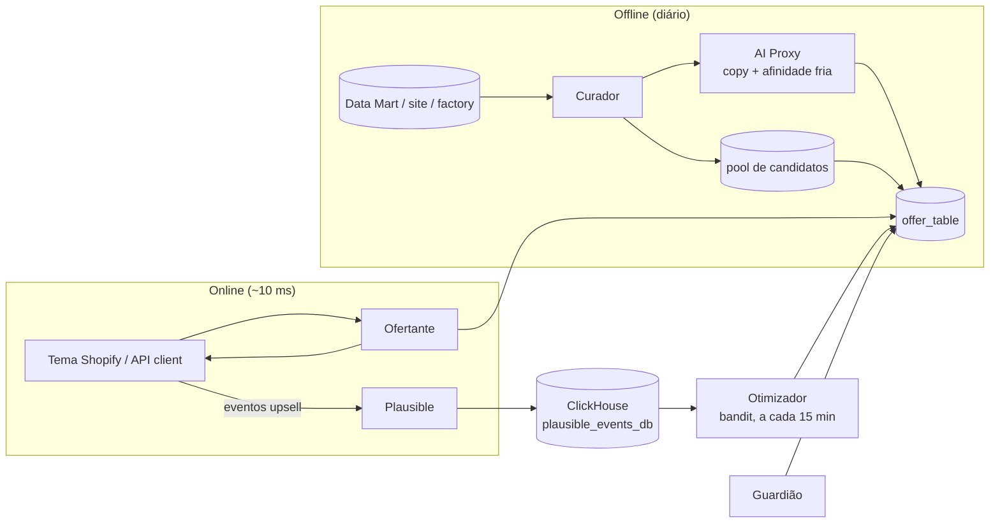
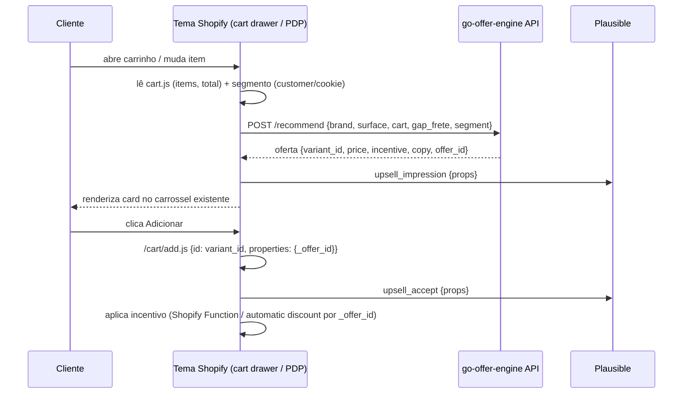

# Handoff — go-offer-engine (GoHacks Podium 2026)

2026-09-18 · @Lucas

## Contexto

O projeto é um **motor de oferta inteligente**: uma API que recebe o contexto do carrinho e devolve o produto certo para ofertar (order bump, upsell, brinde ou cross-sell), já com o incentivo calculado. Qualquer superfície (carrinho, checkout, PDP, CRM) consome o mesmo motor.

**Repositório:** `go-offer-engine`. **Fonte de aprendizado:** eventos de upsell enviados pelo tema ao Plausible (aceite/recusa por SKU do carrinho × SKU ofertado), lidos do ClickHouse pelo Otimizador.

**POC:** Shopify, superfícies PDP e carrinho, marcas Barbour's e Rituária. Documentos irmãos: [Plano de dados — go-offer-engine (Barbour's e Rituária)](project/a224b4f5-fb02-44f1-8727-60804fdc3d41) (fontes, SQL, checklist) e [go-offer-engine — Caso de negócio e projeções](project/9d41f0bf-b5be-4990-9c33-20696df00000) (problema, exemplos reais, projeções, pitch de negócio).

**Tese em uma frase:** Gogroup tem \~R$ 27 M parados em estoque e gasta \~R$ 11 M/mês em incentivo uniforme. Um único cérebro de oferta transforma o estoque parado em AOV e substitui desconto em dinheiro por oferta com margem.

**Critérios da banca (GoHacks Podium):**

| Critério | Peso | O que a banca quer ver |
| --- | --- | --- |
| Modelagem | 50% | Execução, uso de agentes e autonomia da solução |
| Conceito | 20% | Público claro e necessidade real atendida |
| Viabilidade | 20% | Potencial de implementação e impacto no negócio |
| Impacto financeiro | 10% | Saving ou receita gerada |

**Regras do toolkit que não podem ser violadas:** nada que automatize planilha ou relatório; nenhum chatbot interno; nenhum dashboard novo; ganho simulado não vale. Solução tem que ser aplicável na semana seguinte.

**Temas do toolkit atacados:** 4 (slow moving), 1 (incentivos), 6 (conversão/AOV), 3 (reembolso por brinde errado), 7 (recompra via CRM) e 8 (ganhar mais dinheiro).

## Diagnóstico do upsell atual — falhas inegociáveis

O upsell de carrinho hoje é estático e decidido no feeling, e produz ofertas que não fazem sentido para o cliente nem para o negócio. Os quatro casos abaixo são o "antes" do pitch e definem as regras duras que o motor precisa cumprir desde a primeira versão.

| Loja | O que o carrinho mostra hoje | Por que está errado | Regra dura que resolve |
| --- | --- | --- | --- |
| Rituária | Carrinho com Magnésio Inositol (R$ 89,90); upsell fixo "Trio de Queridinhos" (R$ 149,90), kit que **já contém** o produto do carrinho | Oferta mais cara que o carrinho, redundante e ignora que faltam R$ 109 para frete grátis | Nunca ofertar kit que contenha SKU já no carrinho (`kit_components`); teto de preço da oferta ≤ 60% do carrinho; priorizar fechar o gap de frete grátis |
| Gocase (Tote Mini) | Tote Mini R$ 199,90, nenhuma recomendação | Cliente já bateu 3x sem juros; existe gap para frete grátis e não há oferta barata para fechar | Sempre há oferta quando existe gap de threshold; candidato com `price` ≈ gap e alta afinidade (acessório da bolsa) |
| Gocase (Garrafa Fresh) | Brinde Gift Base Fit Preta P **e** upsell "Base de Silicone Fit P" por R$ 29,90 | Oferecer para venda o mesmo item dado de brinde: cliente não paga pelo que já ganhou e a marca sinaliza que o item não vale nada | Excluir do pool de upsell qualquer SKU (ou equivalente funcional) presente como brinde no carrinho; brinde e upsell saem do mesmo motor, nunca de regras separadas |
| Ápice | Kit Cachos R$ 180,41; faltam R$ 9,10 para frete grátis; upsell é um segundo kit de R$ 209,90 com itens perto de romper | Ninguém adiciona R$ 210 para ganhar R$ 20 de frete; oferta sem incentivo, cara e de outra linha; estoque com risco de ruptura | Quando faltam ≤ R$ 30 para um threshold, a oferta precisa custar entre o gap e 3× o gap; `available` abaixo da segurança sai do pool; itens de linha compatível (mesma necessidade) primeiro |

**Regras duras consolidadas (aplicadas antes do score, sem exceção):**

1. Não ofertar SKU já no carrinho, nem kit que contenha qualquer SKU do carrinho, nem SKU que compõe um kit já no carrinho.
2. Não ofertar como upsell o item (ou equivalente funcional) que está como brinde no pedido.
3. Se existe gap para threshold (frete grátis, parcelamento), o candidato prioritário tem preço entre `gap` e `3 × gap`, e o copy nomeia o benefício ("leve X e ganhe frete grátis").
4. Preço da oferta ≤ 60% do valor do carrinho, salvo `goal = margin` com `price_target` explícito.
5. Nunca ofertar SKU com `available` abaixo do estoque de segurança ou com cobertura < 15 dias.
6. Preferir mesma linha/necessidade (afinidade por regra ≥ 0,5) a produto de outra categoria.

**Kits e faixa de preço ofertável — obrigatório no modelo:** o motor precisa conhecer a **composição de cada kit**, o **custo por componente** e o **espaço de preço** disponível para ofertar o produto com desconto sem furar o piso de margem. Ver `kit_components` e `price_room` no Modelo de dados. Sem isso, o motor repete o erro da Rituária e da Ápice.

## Escopo do MVP (1 dia)

O coração que não pode ser mock: **pool de candidatos com dado real → API de oferta → aceite/recusa realimentando o ranking**. Tudo o mais pode ser simplificado.

**Entra:**

- Uma marca piloto (sugestão: Barbour's ou Ápice — Shopify, carrinho nosso; alternativa Gocase restrita a acessórios universais)
- Pool de candidatos real: SKUs com custo, cobertura de estoque e afinidade por co-compra (últimos 90 dias)
- API `POST /recommend` com score determinístico e 3 goals (`aov`, `stock`, `margin`)
- Snippet de order bump no carrinho consumindo a API, com evento de aceite/recusa
- Job do Curador (lote) gerando copy e motivo por oferta via AI Proxy
- Otimizador simples (Thompson Sampling por oferta × contexto)
- Log de decisões legível: oferta, score, incentivo, motivo, resultado

**Fica de fora (roadmap no último slide):**

- Checkout Yampi, PDP e CRM como consumidores
- Kits, variantes dependentes de aparelho na Gocase
- Integração de estoque em tempo real com Protheus (snapshot diário basta)
- Painel de gestão (é dashboard — proibido pelo toolkit)

**Superfície da demo:** o mesmo carrinho, três goals → três ofertas diferentes com incentivo diferente. Troca o segmento (novo → recorrente) → oferta muda. Clica em aceitar/recusar → o ranking muda ao vivo. Plano B: GIF gravado do fluxo completo.

## Arquitetura: IA em lote, motor por tabela

A requisição em tempo real **nunca chama um modelo**. A IA roda em lote (uma vez por SKU/par, de madrugada) e persiste o resultado; o carrinho consulta uma tabela de ofertas pré-calculadas. Custo de IA por pedido: zero.



Leitura: o Curador constrói e a IA enriquece; o Ofertante só faz lookup; o tema envia impressão/aceite/recusa ao Plausible com props de SKU; o Otimizador lê o ClickHouse e reajusta o ranking sem tokens; o Guardião pausa o que fura piso ou canibaliza.

**Camadas de custo, em ordem:**

1. Score determinístico — aritmética, 0 tokens. Resolve 100% das requests.
2. Pré-computação + cache — chave normalizada (SKUs ordenados, ticket em faixas, segmento, superfície, goal). \~1.200 combinações para 100 SKUs. Hit rate esperado > 95%.
3. IA em lote — 1 chamada por par relevante, cache de 30 dias. \~1.000 pares × 500 tokens ≈ 500 k tokens/mês por marca.
4. IA sob demanda — só para campanha nova de CRM (1 request por campanha) ou contexto inédito, sempre assíncrono.

**Anti-refém:** toda chamada passa pelo AI Proxy (fornecedor é config); saídas persistidas; orçamento de tokens por marca/dia com degradação automática para score puro + copy template.

**Stack sugerida:** GoDeploy (Cloudflare Worker) para API e jobs; Postgres/KV para tabelas; Shopify theme snippet para o carrinho; GoRag `runQuery` para carga inicial.

### Integração com o tema Shopify (carrinho e PDP)

Os carrinhos das lojas já têm um carrossel de upsell ("Aproveite e compre junto", "Complemente seus cuidados com", "Complete sua coleção") e uma barra de progresso de benefício (frete grátis / 3x sem juros). O motor **substitui a fonte** desses componentes, não o layout: o mesmo carrossel passa a renderizar o que a API devolve.



**Pontos de integração:**

| Componente do tema | O que muda | Como |
| --- | --- | --- |
| Carrossel de upsell do cart drawer | Lista vem da API em vez de coleção fixa / app | Seção Liquid + JS: fetch `/recommend` no evento `cart:updated`; renderiza 1–3 cards; fallback para a coleção atual se a API falhar (timeout 300 ms) |
| Barra de progresso (frete grátis / parcelamento) | Passa o `gap` para a API como contexto | Já calcula `threshold − total`; enviar no request para o motor priorizar oferta que fecha o gap |
| PDP — "compre junto" | Mesma API com `surface = pdp` e `cart = [produto da página]` | Bloco na seção de produto; renderiza abaixo do add-to-cart |
| Add-to-cart da oferta | Marca a linha como oferta do motor | `/cart/add.js` com `properties: {_offer_id, _offer_sku}` — a propriedade viaja até o pedido e permite fechar o loop (`upsell_purchase`) |
| Incentivo (desconto no item ofertado) | Aplicado sem cupom manual | Opção A: **Shopify Function de desconto automático** que lê `_offer_id` na line item property e aplica o % informado pela API (assinado para evitar fraude). Opção B (POC rápida): desconto via variante já precificada ou `discount code` automático aplicado por `/discount/CODE` redirect. Yampi: repassar como desconto de item pelo Middleware se necessário |
| Telemetria | Eventos com props | `plausible('upsell_impression', {props})` etc., mesma tag já ativa no tema |

**Segmento (novo/recorrente):** `customer.orders_count` no Liquid quando logado; cookie de primeira visita / `customer_id` do Insider quando anônimo; default `new`.

**Fallbacks obrigatórios no tema:** API indisponível → carrossel atual; oferta com `variant_id` sem estoque no `cart.js` → próximo do ranking; sem oferta válida → esconde o bloco (nunca mostra oferta vazia).

**Estudo Shopify a fazer pelo agente antes de codar:** (1) como os kits estão modelados nas duas lojas — Bundles nativos, app ou produto simples; (2) qual app/seção gera o carrossel atual (para substituir a fonte sem quebrar o CSS); (3) se o checkout Yampi preserva line item properties (para o `_offer_id` chegar ao pedido); (4) se a loja tem Shopify Functions habilitadas (plano) para o desconto automático.

## Modelo de dados

Três tabelas de entrada consolidadas por SKU/variante e duas derivadas. O motor lê só as derivadas. Campos marcados **\[mín\]** são o mínimo para amanhã; sem `cogs` o motor não tem piso de margem — é o único campo inegociável.

### 1. `product_master` — quem é o produto

| Campo | Por quê | Fonte provável |
| --- | --- | --- |
| `sku`, `variant_id`, `product_id` **\[mín\]** | Publicar a oferta no carrinho | Shopify Admin / `velociraptor_products` (Gocase) |
| `brand`, `title`, `image_url`, `handle` **\[mín\]** | Renderizar o bump | catálogo |
| `category`, `collection`, `line`, `product_type` **\[mín\]** | Afinidade por regra | catálogo |
| `attributes` (compatibilidade, fragrância, cor, tamanho) **\[mín na Gocase\]** | Evitar oferta incoerente | catálogo |
| `is_active`, `is_gift_eligible`, `is_bump_eligible` **\[mín\]** | Filtros duros | flag nova |
| `weight`, `dimensions` | Frete marginal | logística |

### 1b. `kit_components` — do que cada kit é feito **\[mín\]**

Sem esta tabela o motor não sabe que o Trio contém o Magnésio nem que a Base Fit é o brinde da Garrafa. Uma linha por componente.

| Campo | Por quê | Fonte provável |
| --- | --- | --- |
| `kit_sku`, `component_sku`, `qty` | Detectar sobreposição kit ↔ carrinho nos dois sentidos | Shopify (bundles/metafields) / Protheus (estrutura de produto) |
| `component_cogs`, `component_list_price` | Custo do kit = soma dos componentes; valor percebido | product\_cost |
| `kit_discount_pct` = 1 − kit\_price ÷ soma(list\_price dos componentes) | Quanto o kit já entrega de desconto embutido | derivado |
| `is_gift_component` | Marca o item que sai como brinde junto do principal (ex.: Base Fit com a Garrafa) | regra de brinde atual |
| `functional_group` | Equivalência funcional (base P preta ≈ base P outra cor) para a regra de brinde ↔ upsell | catálogo |

### 3b. `price_room` — quanto dá para descontar (derivada) **\[mín\]**

Calcula, por SKU e por contexto, o espaço entre o preço atual e o menor preço que respeita o piso de margem. É o que decide se o produto **pode** entrar descontado e até onde.

| Campo | Cálculo |
| --- | --- |
| `sku`, `brand` | grão |
| `floor_price` | `(cogs + frete_marginal + picking) ÷ (1 − tax_rate − piso_margem)` |
| `current_price` | Shopify |
| `room_abs` = current\_price − floor\_price | R$ disponíveis para desconto |
| `room_pct` = room\_abs ÷ current\_price | % máximo de desconto sem furar o piso |
| `min_bundle_price` (para kits) | soma dos `floor_price` dos componentes |
| `stock_bonus_pct` | espaço extra liberado por slow moving (ex.: +5 pp se cobertura > 180 d, +10 pp se dead) |

Regra de uso: `incentive_value ≤ room_pct + stock_bonus_pct`. Para kits, o motor só oferta se `kit_price × (1 − incentive) ≥ min_bundle_price`. Kits de valor alto (> 60% do carrinho) saem do pool de upsell de carrinho e ficam para PDP/CRM.

### 2. `inventory_snapshot` — quanto tem e quanto gira

| Campo | Por quê | Fonte provável |
| --- | --- | --- |
| `sku`, `available` **\[mín\]** | Não ofertar o que rompe | `factory` (Gocase) / datamart-Protheus (Gobeaute) |
| `on_hand`, `reserved`, `location` | Detalhe por CD | idem |
| `avg_daily_sales_30d`, `avg_daily_sales_90d` | Cobertura | line items |
| `coverage_days` **\[mín\]** | Gatilho de slow moving (> 180 d) | derivado |
| `stock_status` (normal / slow / discontinued / dead) **\[mín\]** | Peso de urgência | derivado |
| `age_days` | Beauty: validade | ERP |
| `snapshot_at` | Frescor | — |

### 3. `product_cost` — quanto custa dar ou vender

| Campo | Por quê | Fonte provável |
| --- | --- | --- |
| `cogs` **\[mín\]** | Piso de margem do incentivo | Protheus / FP&A |
| `list_price`, `current_price` **\[mín\]** | Desconto real | Shopify |
| `marginal_shipping_cost` | Bump raramente muda faixa de frete; brinde ≈ 0 | logística |
| `tax_rate` | Margem líquida | FP&A |
| `gift_landed_cost` = cogs + frete marginal + picking | Custo real do brinde, comparável ao cupom | derivado |

### 4. `affinity_matrix` — o que faz sentido junto (derivada)

| Campo | Cálculo |
| --- | --- |
| `anchor_sku`, `candidate_sku` | par (âncora pode ser coleção na Gocase para reduzir esparsidade) |
| `co_purchase_count_90d`, `lift` = P(B\|A) / P(B) | line items (`site` / `gold.vw_yampi_orders`) |
| `rule_affinity` (0–1) | mesma linha, compatível, complementar |
| `ai_affinity` (0–1) | Curador em lote, só para pares sem histórico |
| `affinity_score` | combinação ponderada |

### 5. `offer_table` — a decisão pronta para lookup (derivada)

| Campo | Origem |
| --- | --- |
| `context_key` (anchor × segment × surface × goal × brand) | Curador |
| `sku`, `price`, `incentive_type`, `incentive_value` | Curador |
| `expected_margin`, `coverage_days`, `affinity_score`, `score` | Curador |
| `copy`, `reason` | AI Proxy (lote) |
| `impressions`, `accepts`, `take_rate` | Otimizador |
| `valid_until`, `generated_at` | Curador |

### 6. `offer_events` — telemetria de upsell via Plausible (derivada)

Fonte canônica de aprendizado. O tema envia eventos custom ao Plausible com props; o Otimizador lê do ClickHouse (`plausible_events_db`) e agrega por par âncora × oferta.

**Eventos que o tema deve disparar (`plausible('<evento>', {props})`):**

| Evento | Quando | Props obrigatórias |
| --- | --- | --- |
| `upsell_impression` | oferta renderizada no carrinho/checkout/PDP | `offer_id`, `anchor_sku`, `offer_sku`, `surface`, `goal`, `segment`, `incentive_type`, `incentive_value`, `brand` |
| `upsell_accept` | clique em adicionar | mesmas + `offer_price` |
| `upsell_reject` | fechou/ignorou (ou impressão sem aceite ao sair do carrinho) | mesmas |
| `upsell_purchase` | pedido pago contendo `offer_sku` | mesmas + `order_id` |

Regras: props sempre em string; `anchor_sku` = SKU do item de maior valor no carrinho (mesma regra do `context_key`); se o carrinho tem vários itens, enviar também `cart_skus` (lista separada por `|`) para aprendizado por combinação. Um evento por oferta exibida — não agrupar.

**Agregação lida pelo Otimizador (a cada 15 min):**

| Campo | Cálculo |
| --- | --- |
| `anchor_sku`, `offer_sku`, `surface`, `segment`, `brand` | grão |
| `impressions`, `accepts`, `purchases` | `countIf(name = 'upsell_…')` por grão, janela móvel de 30 d |
| `take_rate` | accepts ÷ impressions |
| `purchase_rate` | purchases ÷ accepts |
| `revenue_incremental` | soma de `offer_price` nos `upsell_purchase` |

O que o motor aprende: quais ofertas convertem por SKU do carrinho, em qual superfície e para qual segmento; pares com alto aceite sobem no ranking e ganham incentivo menor; pares sem aceite saem do pool. Isso é a base do `take_rate_aprendido` do score.

Instrumentação: reaproveitar o padrão dos eventos de funil já ativos no Plausible (`add_to_cart`, `begin_checkout`); validar com Claude Code que as props chegam no ClickHouse antes da demo.

### Cadência

| Tabela | Refresh | Onde |
| --- | --- | --- |
| product\_master | diário ou webhook Shopify | Postgres do motor |
| inventory\_snapshot | diário + `available` quente via Shopify | Postgres do motor |
| product\_cost | semanal | Postgres do motor |
| affinity\_matrix | semanal | job SQL |
| offer\_table | diário (Curador) + incremental (Otimizador) | KV/Postgres |
| offer\_events | a cada 15 min (Otimizador lê ClickHouse) | ClickHouse plausible\_events\_db → agregado no Postgres do motor |
| kit\_components | diário ou ao criar/alterar kit | Postgres do motor |
| price\_room | diário (após cost + inventory) | derivada no Postgres do motor |

Questions do Metabase para reaproveitar SQL: 27585 (receita por cupom/dia), 27587 (1ª compra por cupom), 27662 (recompra × cupom), 27636 (descontos por tipo), 27551 (funil Gobeaute), 27661 (catálogo Gocase). Confirmar colunas em runtime com `getDataSourceSchema` antes de fixar nomes.

### Fallback: Shopify como fonte única (via MCP / Admin GraphQL)

Se Data Mart, factory ou Protheus não estiverem acessíveis a tempo, todas as tabelas de entrada e a matriz de afinidade podem nascer só do Shopify da marca piloto. Perde-se precisão de custo e histórico longo, mas o loop completo roda no dia. O conector Shopify MCP já está conectado (`graphql_query`, `get-product`, `get-inventory-levels`, `list-orders`, `search_products`, `search_collections`).

| Tabela | Objeto Shopify | Campos | Limitação |
| --- | --- | --- | --- |
| `product_master` | `products` / `productVariants` (`search_products`, `get-product`) | id, sku, title, handle, productType, collections, tags, images, metafields de atributo | tags/metafields precisam estar preenchidos para afinidade por regra |
| `kit_components` | `productVariant.productVariantComponents` (Shopify Bundles) ou metafield de composição | componentes e quantidades | kits criados como produto simples sem bundle exigem metafield manual — mapear os kits ativos da marca piloto à mão se preciso |
| `inventory_snapshot` | `inventoryLevels` (`get-inventory-levels`) | available, onHand, committed por location | não traz cobertura: calcular `avg_daily_sales` a partir dos pedidos |
| `product_cost` | `inventoryItem.unitCost` | custo unitário | costuma estar vazio ou desatualizado; se ausente, usar piso sobre preço líquido e marcar SKU como "custo estimado" |
| `affinity_matrix` | `orders` 90 d (`list-orders` / `graphql_query` paginado) → line items | pares de SKUs no mesmo pedido, lift | volume alto exige paginação por cursor; começar com 60 d se estourar tempo |
| `offer_events` | — | — | continua vindo do Plausible; Shopify não substitui |

Ordem de carga no fallback: produtos e coleções → variantes e bundles → inventário → pedidos 90 d → derivar cobertura, afinidade e `price_room`. `run-analytics-query` (ShopifyQL) acelera vendas por SKU/dia se o GraphQL de pedidos ficar lento.

Regra de honestidade: toda tabela carregada por fallback recebe `source = 'shopify'` e `confidence`; o Curador reduz o peso de margem quando o custo é estimado, e o pitch declara que o piloto roda com dados do Shopify e migra para Data Mart/Protheus na semana seguinte.

## Score e lógica de incentivo

O score é explícito e determinístico para a banca entender em 10 segundos e para o motor não depender de modelo:

`score = afinidade × margem_pós_incentivo × urgência_de_estoque × take_rate_aprendido`

| Fator | Como calcular | Faixa |
| --- | --- | --- |
| `afinidade` | `affinity_score` da matriz (co-compra + regra + IA fria) | 0–1 |
| `margem_pós_incentivo` | `(price − incentive − cogs − frete_marginal − tax) / price`; zero se abaixo do piso | 0–1 |
| `urgência_de_estoque` | 1,0 normal; 1,5 se cobertura > 180 d; 2,0 dead/descontinuado; 0 se `available` < estoque de segurança | 0–2 |
| `take_rate_aprendido` | posterior Beta(aceites + 1, recusas + 1) amostrada pelo Otimizador; começa neutro | 0–1 |

**Pesos por goal** (sobrescrevem a fórmula base):

| Goal | Prioriza | Uso típico |
| --- | --- | --- |
| `aov` | afinidade × take\_rate | order bump no carrinho |
| `stock` | urgência × margem | brinde, missão de afiliado, CRM de liquidação |
| `margin` | margem × take\_rate | checkout, campanhas com CAC alto |

**Lógica do incentivo (escada — sempre o menor que converte):**

**Filtros duros antes do score** (ver Diagnóstico): sem sobreposição kit ↔ carrinho, sem brinde como upsell, teto de 60% do carrinho, estoque acima da segurança, e — quando há gap de threshold — preço entre `gap` e `3 × gap`. Só o que passa nos filtros é pontuado.

1. Sem incentivo (preço cheio) — default para recorrentes com alta afinidade
2. Frete já coberto pelo pedido (custo ≈ 0)
3. Brinde de slow moving acima de ticket X (custo = `gift_landed_cost`)
4. Desconto % no bump, até `max_discount` do request, respeitando o piso de margem

**Pisos e tetos (configuráveis por marca):**

- Piso de margem pós-incentivo: 30% (beauty), 25% (Gocase acessórios) — ajustar com FP&A
- Teto de desconto no bump: 15%
- Estoque de segurança: `available` ≥ 7 dias de venda média, ou ≥ 20 unidades
- Beauty: `age_days` ≤ 70% da validade para brinde
- Nunca ofertar item já no carrinho nem da mesma variante

## Contrato da API

Dois endpoints síncronos e um job. O `/recommend` é lookup puro; o `/event` alimenta o Otimizador.

### `POST /recommend`

```json
{
  "brand": "barbours",
  "surface": "cart",
  "goal": "aov",
  "cart": [{ "sku": "BRB-SER-30", "variant_id": 4411, "qty": 1, "price": 129.90 }],
  "customer": { "is_returning": false, "channel": "meta", "id_hash": "…" },
  "price_target": null,
  "max_discount": 0.15,
  "n": 1
}
```

Resposta:

```json
{
  "offer_id": "of_8f2a",
  "sku": "BRB-HID-50",
  "variant_id": 4420,
  "title": "Hidratante Facial 50 ml",
  "image_url": "…",
  "price": 89.90,
  "incentive": { "type": "percent", "value": 10 },
  "final_price": 80.91,
  "expected_margin": 0.41,
  "stock_coverage_days": 212,
  "affinity_score": 0.78,
  "score": 0.53,
  "copy": "Completa a rotina do sérum: leve o hidratante com 10% off",
  "reason": "co-compra alta; estoque com 212 dias de cobertura",
  "ttl_seconds": 900
}
```

Regras: `price_target` preenchido força o preço e o motor devolve só candidatos que respeitam o piso; `n > 1` devolve lista ordenada; contexto sem entrada na `offer_table` cai para score em tempo real e enfileira análise do Curador.

### `POST /event`

```json
{ "offer_id": "of_8f2a", "event": "impression|accept|reject|purchase", "order_id": null, "ts": "…" }
```

`/event` é o canal de feedback imediato (demo e fallback). A fonte canônica de aprendizado é o Plausible: o tema dispara `upsell_impression` / `upsell_accept` / `upsell_reject` / `upsell_purchase` com as props da seção `offer_events`, e o Otimizador lê o ClickHouse a cada 15 min. Na demo, `/event` atualiza o ranking na hora para a banca ver o loop; em produção, o Plausible é a verdade.

### `POST /curate` (job, protegido)

Recalcula pool, afinidades e `offer_table` de uma marca; chama o AI Proxy só para pares sem `copy` ou com `generated_at` > 30 dias.

### Chave de cache

`brand:surface:goal:segment:anchor:ticket_band` — `anchor` = SKU ou coleção do item de maior valor no carrinho; `ticket_band` em faixas de R$ 50; `segment` = `new|returning`.

## Agentes

Quatro agentes com papel, entrada, saída e cadência distintos. É aqui que estão os 50% de modelagem: a banca precisa ver o loop Curador → Ofertante → Otimizador → Guardião rodando, não descrito.

| Agente | Entrada | Saída (ação concreta) | Cadência | Usa IA? |
| --- | --- | --- | --- | --- |
| **Curador** | product\_master, inventory\_snapshot, product\_cost, line items 90 d | pool de candidatos, affinity\_matrix, offer\_table com copy e motivo | diário (job `/curate`) | Sim, em lote — copy e afinidade fria |
| **Ofertante** | request `/recommend` | oferta com incentivo calculado, `offer_id` | tempo real (\~10 ms) | Não — lookup + score |
| **Otimizador** | `eventos Plausible (ClickHouse) + /event` | take\_rate atualizado, ranking re-amostrado, incentivo ajustado por contexto | por evento | Não — Thompson Sampling |
| **Guardião** | offer\_table, métricas de CR/AOV/margem, `available` | pausa oferta abaixo do piso, troca SKU em ruptura, reverte incentivo se CR cair | a cada 15 min | Não — regras |

**Autonomia demonstrável:** cada ação fica em `decision_log` (agente, contexto, decisão, motivo, resultado). Na demo, mostrar o log rolando enquanto o carrinho é usado é a evidência de autonomia com controle.

**Prompts do Curador (AI Proxy, em lote):**

- Copy: dado par âncora → candidato, marca e tom da marca, gerar 1 frase de oferta ≤ 90 caracteres e 1 motivo ≤ 60 caracteres. Saída JSON estrita.
- Afinidade fria: dado par sem co-compra, atributos dos dois produtos, devolver `ai_affinity` 0–1 e justificativa curta. Só para pares com `urgência ≥ 1,5` (slow moving) para limitar volume.

**Guardrails do Guardião (por marca):**

- CR do braço teste < controle − 0,3 pp por 2 h → pausa bump
- Margem média das ofertas aceitas < piso → reduz incentivo em 1 degrau da escada
- `available` do SKU ofertado < segurança → troca pelo próximo do ranking
- Oferta com > 200 impressões e take rate < 1% → sai do pool por 7 dias

## Plano de execução (1 dia, dupla)

Regra: às 14h o loop mínimo precisa estar rodando ponta a ponta, mesmo feio. Polimento só depois. Se faltar tempo, o snippet do carrinho pode ser mock visual; o loop Curador → API → evento → ranking não pode.

| Hora | Pessoa A — dados e regras | Pessoa B — serviço e front | Checkpoint |
| --- | --- | --- | --- |
| 08:00–09:30 | Escolher marca; carga de `product_master` + `product_cost` (cogs, preço) via GoRag `runQuery` (fallback: Shopify MCP); carregar kit\_components; validar SKU 1:1 Shopify ↔ base | Subir app GoDeploy; schema das 5 tabelas; `POST /recommend` com resposta fixa | API responde; base tem SKU, preço, cogs |
| 09:30–11:00 | `inventory_snapshot` (available, cobertura, status); `affinity_matrix` por co-compra 90 d | Score determinístico + escada de incentivo; chave de cache; `POST /event` | `/recommend` devolve oferta real com score |
| 11:00–12:30 | Job Curador: gera `offer_table`; prompts de copy/motivo via AI Proxy para o pool | Otimizador (Beta por oferta × contexto); `decision_log` | Aceite muda ranking; log rolando |
| 12:30–13:00 | Almoço | Almoço | — |
| 13:00–14:30 | Guardião: regras de piso, ruptura, take rate; pisos por marca | `Snippet do carrinho Shopify consumindo a API; disparar eventos upsell_* ao Plausible com props de SKU e, em paralelo, /event; validar payload, variant IDs e chegada das props no ClickHouse com Claude Code` | **Loop ponta a ponta rodando** |
| 14:30–16:00 | Roteiro da demo: 3 goals × 2 segmentos no mesmo carrinho; números reais do pool (R$ em slow moving ofertável) | Ajustes visuais; gravar GIF plano B; deploy estável | Demo ensaiada 2× |
| 16:00–17:30 | Slides no padrão Gogroup (`gogroup-presentation`), máx. 3 elementos por slide | Sabatina simulada; respostas técnicas em 2 frases + tela | Pitch cronometrado ≤ 5 min |
| 17:30–18:00 | Buffer | Buffer | Checklist final do toolkit |

**Decisões a tomar antes das 8h:**

- [ ] Marca piloto (Barbour's / Ápice / Gocase acessórios)
- [ ] Piso de margem e teto de desconto iniciais
- [ ] Onde roda a base (Postgres do GoDeploy vs schema no datamart)
- [ ] Quem é o usuário-chave nomeado no pitch (gerente de marca que hoje cria bump/brinde no feeling)

## Medição e A/B de segunda-feira

A/B 50/50 no carrinho da marca piloto por 14 dias: controle sem order bump; teste com o motor em `goal = aov`. Split por sessão, flag no tema, resultados em `gold.analytics_metrics` + pedidos.

| Métrica | Tipo | Fonte | Meta inicial |
| --- | --- | --- | --- |
| Take rate do bump | processo | `Plausible upsell_accept ÷ upsell_impression (ClickHouse)` | ≥ 8% |
| AOV (R$) | negócio | pedidos pagos por braço | + R$ 8–12 no braço teste |
| Margem bruta por pedido (R$) | negócio | pedidos × product\_cost | ≥ controle |
| % desconto / receita | negócio | question 27636 (Gobeaute) | ≤ controle |
| Giro dos SKUs ofertados (dias de cobertura) | estoque | inventory\_snapshot | queda visível nos SKUs slow moving do pool |
| CR sessão → compra | guardrail | funil (27551 / ClickHouse) | ≥ controle − 0,3 pp |
| Reembolso por brinde errado | negócio (fase 2) | base de reembolsos | queda após padronizar picking |

**Âncora para o pitch (hipótese, não ganho realizado):** na Gocase, 259 k pedidos/mês × 10% de aceite × bump de R$ 40 ≈ **R$ 1 M/mês de AOV incremental** sem mídia nova. Dizer explicitamente que é o tamanho da oportunidade a validar em 14 dias — o toolkit penaliza ganho simulado apresentado como fato.

**O que é real hoje e pode ir na demo:** R$ em slow moving elegível a oferta na marca piloto; nº de pares com co-compra; custo real do brinde comprado vs custo do brinde de estoque.

## Riscos e sabatina

**Riscos de execução:**

| Risco | Mitigação |
| --- | --- |
| SKU não bate 1:1 entre Shopify, Middleware e Protheus | Validar no primeiro bloco da manhã; excluir órfãos do pool |
| Sem `cogs` para parte dos SKUs | Ofertar só SKUs com custo; o resto entra depois |
| Gocase depende do aparelho | Restringir a acessórios universais ou herdar modelo do item do carrinho |
| Beauty perto do vencimento vira reembolso | Regra `age_days` no Guardião |
| Co-compra esparsa | Âncora por coleção/linha; regra de afinidade preenche buracos |
| Demo ao vivo falha | GIF gravado do fluxo completo (obrigatório pelo toolkit) |

**Perguntas prováveis da banca e resposta pronta (2 frases + tela):**

| Pergunta | Resposta |
| --- | --- |
| Quanto custa isso de IA por pedido? | Zero. A IA roda uma vez por SKU de madrugada; o carrinho consulta uma tabela. |
| Como funciona tecnicamente? | Uma API de lookup com score determinístico; quatro agentes cuidam do pool, do aprendizado e dos guardrails. Mostrar o log. |
| E se a conversão cair? | Guardião pausa o bump se CR cair 0,3 pp por 2 h. Por isso começa como A/B, não rollout. |
| Como sabe que é incremental? | A/B 50/50 por 14 dias; métrica é AOV e margem por pedido no braço teste vs controle. |
| Isso não é só um order bump? | O bump é a primeira superfície. O mesmo motor responde brinde, CRM, PDP e missão de afiliado — mostrar a chamada com `surface = crm`. |
| O que falta para funcionar em produção? | Snapshot de estoque via Middleware e `cogs` de todos os SKUs. O resto já existe. |
| Por que ninguém fez antes? | Cada canal decide oferta sozinho e no feeling; nunca houve um cérebro único com custo, estoque e afinidade juntos. |

## Pitch (5 minutos)

Segue a arquitetura do toolkit. Se algo tiver que ser cortado, corte texto, não a demo.

| Tempo | Bloco | Conteúdo |
| --- | --- | --- |
| 0:00–0:15 | Abertura | Nome do motor, desafio (temas 4 + 1 + 6), dupla |
| 0:15–0:50 | Dor e usuário-chave | A gerente de marca que hoje escolhe brinde e bump no feeling e só vê o custo no fechamento. Gogroup: R$ 27 M parados em estoque, R$ 11 M/mês em incentivo uniforme |
| 0:50–1:20 | Fluxo atual | 4 passos: escolhe produto → define desconto → publica → descobre resultado 30 dias depois. Fricção: cada canal decide sozinho |
| 1:20–2:10 | Solução | "Nossa solução é \[nome\] — um motor de agentes que decide, para cada carrinho, o produto certo e o menor incentivo que converte, para que estoque parado vire AOV." Encerrar com: "Deixa eu mostrar." |
| 2:10–3:30 | Demo | Mesmo carrinho, 3 goals → 3 ofertas; troca segmento → oferta muda; aceita/recusa → ranking muda; log dos agentes rolando |
| 3:30–4:00 | Métricas | Âncora: 10% de aceite × R$ 40 × 259 k pedidos ≈ R$ 1 M/mês na Gocase. Métrica de processo: take rate. Impacto: AOV e margem por pedido |
| 4:00–5:00 | Impacto e implantação | Segunda: A/B 50/50 em uma marca, 14 dias, guardrail de CR. Dependência: snapshot de estoque + cogs. Roadmap: checkout, CRM, brinde, afiliados no mesmo motor |

**Frases-âncora:**

- "O estoque parado paga o desconto."
- "Zero token por pedido: a IA pensa de madrugada, o carrinho consulta uma tabela."
- "Um cérebro, todas as superfícies."

**Checklist do toolkit antes de subir:**

- [ ] Usuário-chave com nome e contexto
- [ ] Fluxo atual em 3–4 passos visuais
- [ ] Solução em 1 frase com o papel da IA
- [ ] Demo funcionando + GIF de plano B
- [ ] 1 métrica de processo + 1 impacto de negócio
- [ ] Primeiro passo de implantação definido
- [ ] Cronometrado ≤ 5 min; máximo 3 elementos por slide
- [ ] Sabatina simulada
